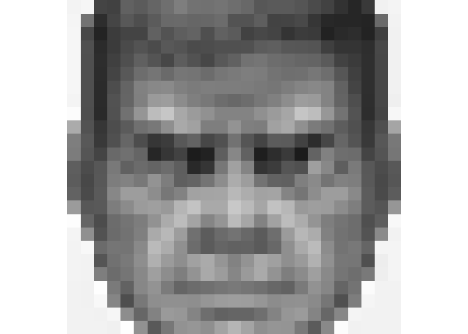
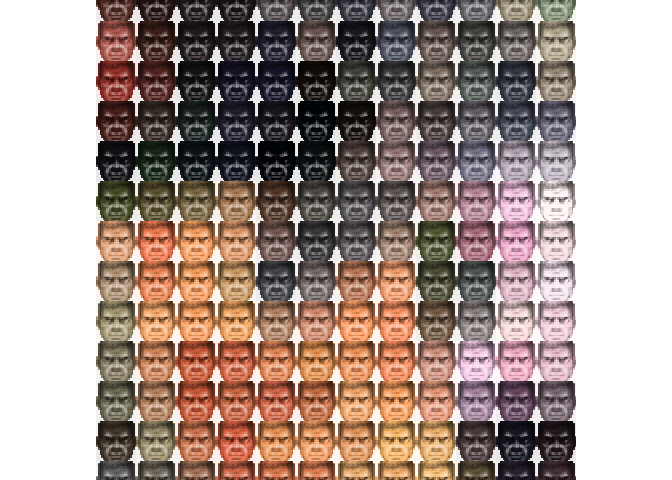

<!-- README.md is generated from README.Rmd. Please edit that file -->

# image-montages

-   A quick and experimental look at creating an image from a montage
    arrangement of a second image - using `{magick}`
    -   This is **super slow** and seems to use a lot of memory on my
        laptop (especially if the image is made larger)

``` r
library(magick)
library(tidyverse)
```

-   Read the ‘main’ background image resized to 100 px wide

``` r
i <- 
  image_read('https://i5.walmartimages.com/asr/105ad9f3-4b18-461e-b158-8f95d7281ec5_1.d436e8e8146bae6cf1bcb2848be5676d.jpeg') %>% 
  image_resize("100x")

image_ggplot(i)
```

<!-- -->

-   Store the width and height of the background image (px)

``` r
info <- image_info(i)
w <- info$width
h <- info$height
```

-   Set the width of the second image used as the ‘pixel’
-   Read the second ‘pixel’ image and crop to fill a square (pix\_size x
    pix\_size)

``` r
pix_size <- 25

i_pix <- 
  image_read('https://www.pngjoy.com/pngm/880/10347686_doom-guy-doom-guy-transparent-png.png') %>% 
  image_convert(colorspace = "gray") %>% 
  image_resize(paste0(pix_size, "x", pix_size, "^")) %>% 
  image_crop(paste0(pix_size, "x", pix_size), gravity = "center")

image_ggplot(i_pix)
```

<!-- -->

-   Iterate through every pixel in background image, creating a
    composite image of the pixel and the ‘pixel’ image
-   Compose type of ‘HardLight’ was found by trial and error - there may
    be a better (‘proper’) compose type to use for this
    -   **This is REALLY slow and memory intensive**

``` r
composites <-
  i %>% 
  image_raster() %>%
  pull(col) %>% 
  lapply(function(x) image_composite(image_colorize(i_pix, opacity=100, color=x), 
                                     composite_image = i_pix, 
                                     operator = "Hardlight")) %>% 
  image_join() %>% 
  image_montage(geometry = geometry_size_pixels(pix_size, pix_size),
                tile = paste0(w, "x", h)) 

composites
```


-   Zoom in

``` r
composites %>% image_crop("300x300", gravity = "center") %>% image_ggplot()
```

<!-- -->
